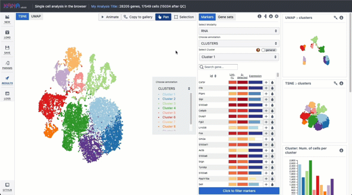
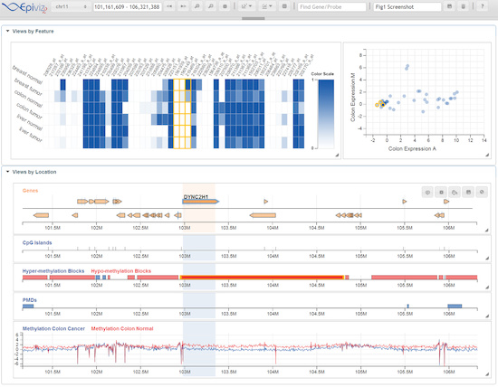
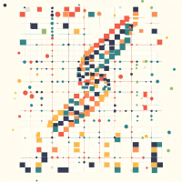

I've been fortunate to work on various projects focused on representing, visualizing, and analyzing genomics data. For a complete list, visit my [GitHub](https://github.com/jkanche).

## Visualization Tools

### Kanaverse: Multi-modal Single-cell Analysis 

<a href="https://kanaverse.org/kana">Kana</a> is a web application for interactive single-cell 'omics data analysis directly in the browser. It leverages WebAssembly to perform computations on the user's machine, eliminating the need for backend services.

The app provides a streamlined workflow for single-cell analysis from count matrix to marker detection. Check out <a href="https://www.biorxiv.org/content/10.1101/2022.03.02.482701v1">our manuscript</a> for details or <a href="https://joss.theoj.org/papers/10.21105/joss.05603">JOSS</a> to cite.

---

### Genome Viewers

<ul>
<li><a href="http://www.epiviz.org/">Epiviz</a> - Interactive visualization platform for functional genomic data. <a href="https://github.com/epiviz/epiviz">GitHub</a></li>
<li><a href="http://www.metaviz.org/">Metaviz</a> - Interactive visualization for metagenomic data. <a href="https://github.com/epiviz/metaviz">GitHub</a></li>
<li>Bioconductor integration through <a href="https://www.bioconductor.org/packages/release/bioc/html/epivizr.html">epivizR</a>, <a href="https://github.com/epiviz/metavizr">metavizr</a>, and <a href="https://www.bioconductor.org/packages/release/bioc/html/epivizrChart.html">epivizChart</a>.</li>
</ul>

---

## JavaScript Libraries

### Genomic Visualization Libraries

- [epiviz.gl](https://github.com/epiviz/epiviz.gl) - High-performance genomic data visualization using WebGL and WebWorkers
  - [epiviz.scatter.gl](https://github.com/epiviz/epiviz.scatter.gl) - Performant scatter/dot plot library
  - [epiviz.heatmap.gl](https://github.com/epiviz/epiviz.heatmap.gl) - Specialized for generating heatmap-like plots
- [unicplot](https://github.com/jkanche/unicplot) - Fun JavaScript library for generating plots using Unicode characters

---

## Analysis tools and methods

### BiocPy: Bioconductor Workflows in Python

BiocPy brings <a href="https://www.bioconductor.org">Bioconductor</a>'s core data structures to Python. These include <a href="https://github.com/BiocPy/BiocFrame">BiocFrame</a> and <a href="https://github.com/BiocPy/GenomicRanges">GenomicRanges</a>, which serve as essential building blocks for complex data representations.

Container classes like <a href="https://github.com/BiocPy/SummarizedExperiment">SummarizedExperiment</a>, <a href="https://github.com/BiocPy/SingleCellExperiment">SingleCellExperiment</a>, and <a href="https://github.com/BiocPy/MultiAssayExperiment">MultiAssayExperiment</a> represent single or multi-omic experimental data and metadata.

Visit the <a href="https://github.com/BiocPy/">BiocPy organization</a> for more information.

---

### ArtifactDB: Language-agnostic Genomic Data Store

ArtifactDB is a storage system for analysis-ready artifacts, providing easy access to datasets and analysis results across multiple programming frameworks like R and Python.

Visit the <a href="https://github.com/ArtifactDB/">ArtifactDB organization</a> for more details.

---

### CellArr: Cell Arrays Backed by TileDB

CellArr provides a TileDB-backed store for large collections of genomic experimental data, supporting millions of cells across multiple single-cell experiment objects.

Visit the <a href="https://github.com/CellArr/">CellArr organization</a> for more information.

---

### Epiviz-related Packages

- [Epiviz File Server](http://epivizfileparser.readthedocs.io/en/latest/) - In-situ query API and transformation of genomic data files. [GitHub](https://github.com/epiviz/epivizFileServer)
- [Epiviz Quindex](https://github.com/epiviz/EpivizQuindex) - Indexing and searching collections of BigWig/BigBed files

---

## Infrastructure & DevOps

### Cloud Infrastructure

- [asynchronous-api-dask-terraform](https://github.com/jkanche/asynchronous-api-dask-terraform) - Terraform modules to orchestrate dask-based dynamic workflows in the cloud
- [pypi-terraform](https://github.com/jkanche/pypi-terraform) - Terraform deployment script for hosting a private PyPI registry