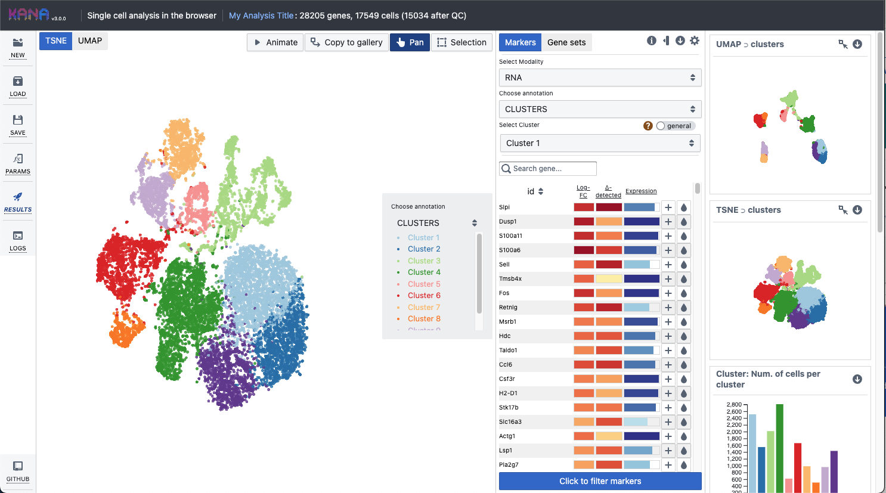

I am currently a **Senior Research Software Engineer** at Genentech. I develop interactive and integrative visual analysis and exploratory tools for biomedical datasets (epigenomic, metagenomics & single-cell). My interests include bioinformatics, data visualization & web development.

Find me on [bsky](https://bsky.app/profile/did:plc:3pz77k4ljmluuqcvz744jx2y), [twitter](http://twitter.com/jayaram), [scholar](http://scholar.google.com/citations?user=CFOvaRwAAAAJ) or send a [message](mailto:jayaram.kancherla@gmail.com).

## Recent Software

For a complete list, visit the [Projects](./About/Projects) section or my [GitHub](https://github.com/jkanche).

  

    
    

      <a class="project-title" target="_blank" href="https://github.com/kanaverse">Kanaverse</a>
      
Multi-modal single-cell analysis and exploration tool with interactive visualizations.

    

  

  
  

    
    

      <a class="project-title" target="_blank" href="https://github.com/biocpy">BiocPy</a>
      
Facilitating Bioconductor workflows in Python.

    

  

  

    
    

      <a class="project-title" target="_blank" href="https://github.com/cellarr">Cell Arrays</a>
      
TileDB backed store and dataloaders for genomics.

    

  

